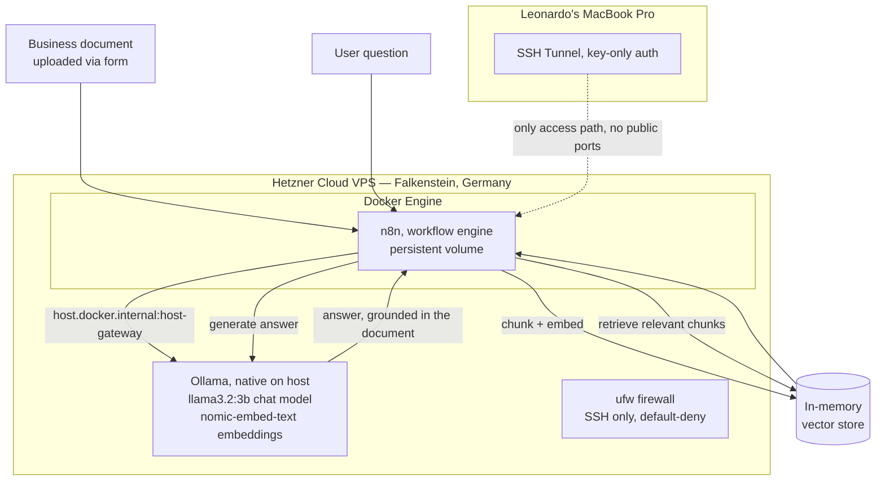

# Private AI Knowledge Pipeline: Self-Hosted RAG on Hardened Cloud Infrastructure

**Built by Leonardo Flores, Lionhall Ventures LLC. September 2026.**

## What this is

A self-hosted Retrieval-Augmented Generation (RAG) system that lets an AI model answer questions using a business's own documents, with every piece of that pipeline, the document storage, the embedding model, the language model, and the vector database, running on infrastructure the business controls. Nothing is sent to an outside AI vendor at inference time. This is the architecture a regulated business (a law firm, a clinic, a financial advisor) needs when its documents legally or practically cannot leave the building.

This project was built in three deliberate stages, each one proving a specific piece of the puzzle before moving to the next, documents are chunked and searchable, then the same pipeline rebuilt fully local with zero cloud calls, then moved onto always-on hardened server infrastructure instead of a laptop.

## Why it matters

Most small businesses adopting AI today do it through a public chatbot with a personal account and no contract behind it. That's fine for drafting a marketing email. It's a real liability the moment anything sensitive, a client's financial details, a patient's chart, a case file, touches that chatbot. The fix isn't refusing to use AI, it's controlling two things: what data goes in, and what infrastructure and legal agreements stand behind the tool. This project demonstrates the technical side of that control, start to finish, built and debugged firsthand rather than read about.

## Architecture

No inbound ports are open except SSH. The n8n interface is reachable only through an SSH tunnel, there is no public URL serving this system, which was a deliberate choice over exposing it with a reverse proxy, since nothing about this build requires public access yet.

## Infrastructure and security decisions

| Decision | What was done | Why |
|---|---|---|
| Server | Hetzner Cloud CX23 (2 vCPU, ~8GB RAM, 40GB disk), Ubuntu 26.04, Falkenstein, Germany | Cheapest tier with enough RAM to run a small local language model and an embedding model side by side. Not AWS, see the mapping table below for how each piece translates. |
| Access | SSH key only, `ed25519` keypair generated locally, no password ever set on the server | Removes password-guessing as an attack surface entirely from day one. |
| Privilege separation | Created a non-root user (`leo`), added to `sudo` and `docker` groups, disabled root SSH login and password authentication in `sshd_config` | Matches the least-privilege principle: the account used day to day cannot log in as root directly, and a compromised key still requires a second step to reach full control. |
| Network exposure | `ufw` firewall enabled, only the SSH port allowed, everything else default-deny | The smallest possible attack surface. Nothing is listening that doesn't need to be. |
| Container-to-host networking | n8n (in Docker) reaches Ollama (native on the host) via `host.docker.internal:host-gateway`, a Linux-specific Docker flag | Keeps Ollama outside the container boundary (simpler to manage, directly uses host resources) while still letting the containerized workflow engine reach it. |
| Data flow | Documents are uploaded directly into the pipeline, chunked, embedded, and stored, all within the VPS. The only external network calls from the pipeline are none, both the embedding model and the chat model run locally on the server. | This is what makes it genuinely private rather than private in name only, there is no step in the pipeline where a document's contents leave infrastructure under direct control. |

## Cost

**$7.09/month total**, Hetzner CX23 server ($6.49) plus a dedicated IPv4 address ($0.60). n8n (community edition) and Ollama are both free and open source. No per-request API costs, since both the chat model and the embedding model run locally rather than calling a paid API per query. The only cost incurred during development that isn't recurring was a small one-time OpenAI API charge during the first, cloud-based proof of concept (see Phase 1 below), since the final architecture replaced that with the free local models entirely.

## How it was built, in three stages

**Stage 1, proof of concept (cloud-based, not yet private).** Built the RAG pattern itself first, using OpenAI for embeddings and Claude for the actual answering, orchestrated in n8n, to learn chunking, vector search, and prompt construction without fighting infrastructure at the same time. Verified it worked by asking a real question about an uploaded document and getting a correct, source-grounded answer back.

**Stage 2, made it actually private (same laptop, zero cloud calls).** Installed Ollama locally, swapped both the embedding and chat models for local equivalents (`nomic-embed-text` and `llama3.2:3b`, sized to fit 8GB of RAM), and rebuilt the exact same pipeline with nothing leaving the machine. This stage is where the real cost of privacy became concrete: the fully local answer took about 55 seconds end to end versus a few seconds for the cloud version, a direct, firsthand demonstration of the tradeoff a client would be accepting by choosing a private setup.

**Stage 3, moved it onto real, always-on server infrastructure.** Provisioned the Hetzner VPS, hardened SSH and the firewall, installed Docker, installed Ollama on the server itself, and rebuilt the pipeline a third time pointing at the server instead of the laptop. Verified end to end again: uploaded a fresh document, confirmed it was chunked and stored, then asked a question whose answer could only come from that document and got it back correctly.

## Real problems hit and fixed along the way

Three are worth calling out specifically, since they're the kind of thing that only shows up from actually building this rather than reading about it:

1. **A retrieval tool silently queries an empty database if its memory key doesn't match the one used to store the data.** Two separate nodes in the workflow each default to their own memory key, and nothing warns you if they don't match, the retriever just returns no results with no error. The fix was confirming both keys were set identically. Worth checking first on any RAG build before assuming anything else is broken.
2. **Embeddings from two different models aren't interchangeable.** Switching from OpenAI's embedding model to the local one required fully re-processing every document from scratch, not just swapping a setting, since the two models produce differently shaped data that can't be compared against each other.
3. **A locked SSH key forced a full server rebuild.** A passphrase was typed by mistake during key generation and never recovered, which locked out the very first server entirely. Rather than fight it, the clean fix was deleting that server (it held nothing yet) and recreating it fresh with a correctly generated, passphrase-free key from the start.

## How this maps to AWS specifically

This project was built on Hetzner Cloud rather than AWS, chosen for cost while learning the pattern. The underlying concepts are not platform-specific, and the same build maps directly onto AWS services:

| This project | AWS equivalent |
|---|---|
| Hetzner CX23 VPS | EC2 instance |
| `ufw` firewall, SSH-only inbound | Security Group with a single inbound rule |
| Non-root user + sudo/docker groups | IAM user or role with least-privilege permissions |
| SSH key-only authentication | EC2 key pair, same principle |
| No public-facing ports | A private subnet in a VPC |
| Manual server hardening | The customer's half of AWS's shared responsibility model |

## What this demonstrates

This is not a claim of being an AI engineer or a software developer. It's evidence of the actual, narrower, and more immediately useful skill: the ability to take a real security and privacy requirement, map it to concrete infrastructure decisions, implement them correctly, and verify the result actually works end to end rather than assuming it does. That is the same skill a business needs whether the question is "can our AI tool see client SSNs" or "is our AWS account configured correctly," and it was built and debugged firsthand, not copied from a tutorial.

## Next steps

This architecture is a template, not a one-off. The natural next version replaces the in-memory vector store with a persistent one, adds basic authentication in front of the n8n interface if broader access is ever needed, and could be rebuilt on AWS directly (EC2 plus a private VPC) as a second, platform-specific version of the same project once that becomes useful to demonstrate.
## Notes
First Git/GitHub rep completed Oct 1, 2026.
